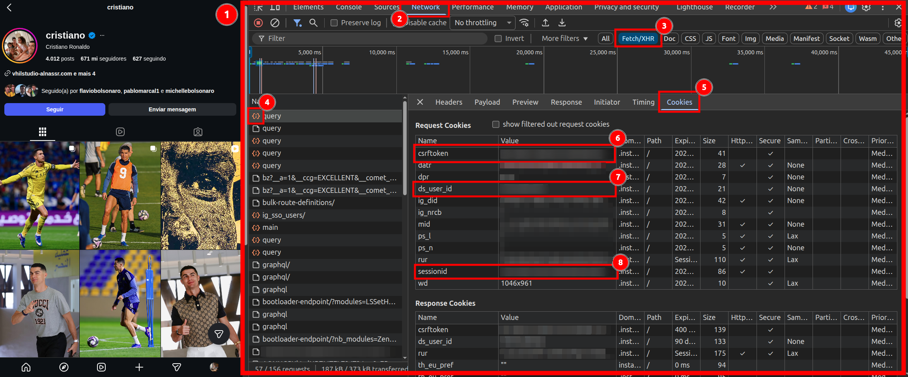

# HOW TO CONFIGURE

> ### To configure `InstaClient`, you will need to extract the authentication cookies directly from your browser.*

<hr>

### Follow the numbered steps in the image below:



- **Access Instagram**: Log in to your profile through your browser (Chrome, Edge, or Firefox).
1. **Inspect Element**: Press `F12` or right-click on the page and select `Inspect`.
2. **Network Tab**: In the developer panel, click on the `Network` tab.
3. **Fetch**: Filter by `Fetch/XHR` to clear unnecessary traffic.
4. **Select a Request**: Click on any request that appears in the list on the left (such as `web_profile_info` or similar) to open the details on the right.
5. **Cookies Tab**: In the request details panel, click the `Cookies` sub-tab.
- **Locate the Values**: Search the table for the following names in the `Name` column:
6. `csrftoken`: Copy the corresponding value from the `Value` column.
7. `ds_user_id`: Locate this field to obtain your account's numeric ID.
8. `sessionid`: This is your session's main token. Copy the complete value.
- **Cookie Extraction**: Use the found values ​​to populate your project's authentication dictionary or environment variables.
- **Validation**: Be sure to copy the values ​​from the "`Request Cookies`" section to ensure they are the active tokens sent by your browser.

<hr>

### Replace with the values ​​collected in steps 7 and 8

```py
from igmapper.client import InstaClient

client = InstaClient(
    csrftoken="value_from_step_7",
    ds_user_id="value_from_step_8",
    sessionid="value_from_step_7"
)
```

> [!WARNING]
> Never share your sessionid. It grants full access to your Instagram account.